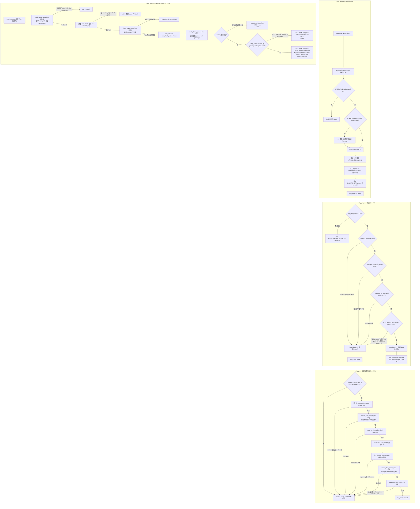

# 通知鏈流程（bash 現行為）

send→notify_or_defer→hook 的決策全圖；Rust 實作照此 parity。

```mermaid
flowchart TD
    subgraph CMD_SEND["cmd_send 通知流 (line 536)"]
        A1["cmd_send 收到發送請求"] --> A2["驗證參數與 to/from 格式 (NAME_RE)"]
        A2 --> A3{"$AGENTS_DIR/$to.json 存在?"}
        A3 -- 否 --> A4["die 未註冊的 agent"]
        A3 -- 是 --> A5{"jq 檢查 spawned==true 且 ready!=true?"}
        A5 -- 是 --> A6["err 警告：尚未回報就緒 (starting)"]
        A5 -- 否 --> A7["取得 agent pane_id"]
        A6 --> A7
        A7 --> A8["建立 task 目錄 $TASKS_DIR/$task_id"]
        A8 --> A9["寫入 request.md / metadata.json / status (queued)"]
        A9 --> A10["重讀 $AGENTS_DIR/$to.json 的 pane_id"]
        A10 --> B1["呼叫 notify_or_defer"]
    end

    subgraph NOTIFY_OR_DEFER["notify_or_defer 判定 (line 371)"]
        B1 --> B2{"ttl 格式符合 ^[0-9]{1,9}$?"}
        B2 -- 否 (壞值) --> B3["die AGENT_BRIDGE_STATE_TTL 格式錯誤"]
        B2 -- 是 --> B4{"ttl > 0 且 state_file 存在?"}
        B4 -- 否 (ttl=0 通道關閉 / 無檔) --> B10["fresh_busy = 0 (未知/legacy)"]
        B4 -- 是 --> B5{"jq 解析 st (.state) 與 ts (.ts) 存在?"}
        B5 -- 否 (缺失/壞JSON) --> B10
        B5 -- 是 --> B6{"date -ud '$ts' +%s 解析 epoch 成功?"}
        B6 -- 否 (解析失敗) --> B10
        B6 -- 是 --> B7{"st == 'busy' 且 0 <= (now - epoch) <= ttl?"}
        B7 -- 否 (st!=busy / ts未來 now-epoch<0 / ts過期 now-epoch>ttl) --> B10
        B7 -- 是 --> B8["fresh_busy = 1 (明確 busy 且新鮮)"]

        B8 --> B9["log_event notify-deferred\n提示 busy 延後通知，不送鍵"]
        B10 --> C1["呼叫 notify_pane"]
    end

    subgraph NOTIFY_PANE["notify_pane 送鍵與雙掃描 (line 330)"]
        C1 --> C2{"pane 符合 PANE_RE 且 tmux list-panes 存活?"}
        C2 -- 否 --> C8["return 1 -> log_event notify-failed"]
        C2 -- 是 --> C3["第一次 tmux capture-pane -pJ (line 344)"]
        C3 -- capture 失敗 (fail-closed) --> C8
        C3 -- 成功 --> C4["screen_has_prompt (line 318)\n掃描有權限/plan對話框?"]
        C4 -- 是 (有框) --> C8
        C4 -- 否 --> C5["tmux send-keys '$cmdline' (line 346)"]
        C5 -- send-keys 失敗 --> C8
        C5 -- 成功 --> C6["sleep NOTIFY_DELAY (預設 0.3s)"]
        C6 --> C7["第二次 tmux capture-pane -pJ (line 353)"]
        C7 -- capture 失敗 (fail-closed) --> C8
        C7 -- 成功 --> C9["screen_has_prompt (line 318)\n再掃描有權限/plan對話框?"]
        C9 -- 是 (有框) --> C8
        C9 -- 否 --> C10["tmux send-keys Enter (line 355)"]
        C10 -- 失敗 (經 notify_or_defer line 412-416) --> C8
        C10 -- 成功 --> C11["log_event notified"]
    end

    subgraph HOOK_STOP["cmd_hook stop 接收端 (line 2131, 2204)"]
        D1["cmd_hook stop 觸發 (Turn 結束時)"] --> D2["hook_agent_name (line 2010)\n從 SPAWN_TAG 析出 agent name"]
        D2 -- 無/壞 SPAWN_TAG (line 2138-2140) --> D0["exit 0 (no-op)"]
        D2 -- 析出成功 --> D3["讀取 stdin JSON 取得 sid (session_id)"]
        D3 -- 缺 session_id (line 2175-2177) --> D0b["exit 0 (不寫 state、不 block)"]
        D3 -- 取得 sid --> D4["hook_owner_gate (line 2069)\n驗證 session 所有權"]
        D4 -- 異主且 state 新鮮 --> D5["exit 0 (靜默放行/不 block)"]
        D4 -- 本人/無主/過期接管 --> D6["stop_active = .stop_hook_active // false"]
        D6 --> D7["hook_oldest_queued (line 2098)\n查詢最舊 queued task (pending)"]
        D7 --> D8{"pending 是否存在?"}
        D8 -- 否 (無待處理 task) --> D9["hook_write_state (line 2035) -> idle\nexit 0"]
        D8 -- 是 --> D10{"stop_active == 'true' 且 pending == last_delivered?"}
        D10 -- 是 (真迴圈訊號：同 task 已擋過一輪) --> D11["hook_write_state (line 2035) -> idle (放行, 不 block)\nexit 0"]
        D10 -- 否 --> D12["hook_write_state (line 2035) -> busy ($pending)\n輸出 JSON decision: block, reason: agent-bridge receive $pending"]
    end
```

