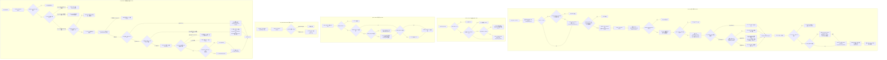

# spawn 生命週期流程（bash 現行為）

cap／ready 探針／原子回滾／出身防護；Rust 實作照此 parity。

```mermaid
flowchart TD
    subgraph CMD_SPAWN["cmd_spawn 建立流程 (line 1063)"]
        S1["cmd_spawn <name> --runtime ..."] --> S2["驗證 name(NAME_RE), runtime, model(MODEL_RE)"]
        S2 --> S3{"runtime == claude?"}
        S3 -- 是 --> S4{"CLAUDE_HOOKS_SETTINGS 為可讀普通檔?"}
        S4 -- 否 --> S5["die settings 缺失"]
        S3 -- 否 --> S6["caller_owner (line 884)\n取得 owner (session_name:@window_id)"]
        S4 -- 是 --> S6
        S6 --> S7{"WORKER_BRIEF (或 SUCCESSOR_BRIEF)\n為可讀普通檔?"}
        S7 -- 否 --> S8["die brief 缺失"]
        S7 -- 是 --> S9["validate_ready_opts (line 988)\n驗證 ready timeout & probe interval"]
        S9 --> S10["acquire_lock agents-registry"]
        S10 --> S11["設置 EXIT trap spawn_rollback (line 940)\n(SPAWN_DONE=0)"]
        S11 --> S12{"$AGENTS_DIR/$name.json 已存在?"}
        S12 -- 是 --> S13["die agent 已註冊"]
        S12 -- 否 --> S14["is_spawned 統計當前 spawned 數 count\n(sp_rc 0或2皆計)"]
        S14 --> S15{"count >= MAX_SPAWN (預設 4)?"}
        S15 -- 是 --> S16["die 已達 spawn 上限"]
        S15 -- 否 --> S17["生成 tag (SPAWN_RB_TAG)\nworker_prompt_arg (line 1007) 組合 prompt_arg"]
        S17 --> S18{"use_window == 1 或 無可沿用視窗?"}
        S18 -- use_window==1 --> S19["tmux new-window 建獨立視窗"]
        S18 -- use_window==0 --> S20{"是否有同 owner 且 @ab_owner == owner\n的 worker_window?"}
        S20 -- 有 --> S21["tmux split-window 沿用視窗 + tiled 重排"]
        S20 -- 無 (有 owner) --> S22["tmux new-window 新建 worker 視窗 (line 1302-1304)\n(@ab_owner 印記在存活檢查後才寫，見 S27b)"]
        S20 -- 無 (無 owner) --> S23["tmux split-window 在當前視窗分割"]
        S19 --> S24["設 SPAWN_RB_PANE=$pane"]
        S21 --> S24
        S22 --> S24
        S23 --> S24
        S24 --> S25["sleep 0.3 進行夭折偵測"]
        S25 --> S26{"tmux list-panes 中 $pane 仍存在?"}
        S26 -- 否 --> S27["die runtime 啟動即失敗 -> 觸發 spawn_rollback"]
        S26 -- 是 --> S27b{"走 S22 新建 worker 視窗?"}
        S27b -- 是 --> S27c["寫入 @ab_owner trust root (line 1329-1340)\n失敗則 die -> rollback (pane 已在回滾範圍)"]
        S27b -- 否 --> S28
        S27c -- 成功 --> S28["atomic_write 寫入 registry JSON doc\nlog_agent_event spawned"]
        S28 --> S29["SPAWN_DONE = 1 (宣告成功，解除回滾)\nrelease_lock"]
        S29 --> S30["呼叫 spawn_wait_ready 等待就緒探針"]
    end

    subgraph SPAWN_WAIT_READY["spawn_wait_ready 探針輪詢 (line 1038)"]
        W1["spawn_wait_ready"] --> W2{"ready timeout == 0?"}
        W2 -- 是 --> W3["直接 return 0"]
        W2 -- 否 --> W4{"jq 檢查 registry 中 ready == true?"}
        W4 -- 是 --> W5["info 就緒成功 return 0"]
        W4 -- 否 --> W6{"SECONDS >= timeout?"}
        W6 -- 是 --> W7["err 警告未回報就緒\n(不回滾，pane 留用診斷) return 0"]
        W6 -- 否 --> W8["notify_pane 送鍵 agent-bridge ready <name>\nsleep probe_interval"]
        W8 --> W4
    end

    subgraph SPAWN_ROLLBACK["spawn_rollback 原子回滾 (line 940)"]
        R1["spawn_rollback 觸發 (EXIT trap)"] --> R2{"SPAWN_DONE == 1?"}
        R2 -- 是 --> R3["no-op 直接返回"]
        R2 -- 否 --> R4{"SPAWN_RB_TAG 是否有值?"}
        R4 -- 是 --> R5{"SPAWN_RB_PANE 有值?"}
        R5 -- 是 --> R6["rb_kill_tagged (line 928)\n(比對 tag 殺指定 pane)"]
        R5 -- 否 --> R7["tmux list-panes 掃描指令含 tag 的孤兒 pane\nrb_kill_tagged 殺孤兒"]
        R4 -- 否 --> R8{"SPAWN_RB_REG 有值?"}
        R6 --> R8
        R7 --> R8
        R8 -- 是 --> R9["rm -f 刪除殘留 registry"]
        R8 -- 否 --> R10["SPAWN_DONE = 1 (回滾完成)"]
        R9 --> R10
    end

    subgraph CMD_READY["cmd_ready Worker Ready 回報 (line 1594)"]
        K1["Worker 在 pane 內執行 agent-bridge ready <name>"] --> K2["acquire_lock agents-registry"]
        K2 --> K3{"is_spawned 驗證 registry?"}
        K3 -- 非 spawned / 損壞 --> K4["die 拒絕執行"]
        K3 -- 通過 (sp_rc==0) --> K5["jq .ready = true 寫回 registry\nrelease_lock"]
    end

    subgraph CMD_DESPAWN["cmd_despawn 回收與出身防護 (line 1476)"]
        D1["cmd_despawn <name>"] --> D2["acquire_lock agents-registry"]
        D2 --> D3{"$AGENTS_DIR/$name.json 存在?"}
        D3 -- 否 --> D4["die 未註冊的 agent"]
        D3 -- 是 --> D5{"is_spawned 檢查出身 (sp_rc)"}
        D5 -- sp_rc==1 (非 spawned / 人工註冊) --> D6["die 非 spawn 出身，despawn 拒絕"]
        D5 -- sp_rc==2 (registry 無法解析) --> D7["die registry 出身不明，despawn 拒絕"]
        D5 -- sp_rc==0 (通過 spawned 驗證) --> D8{"DESPAWN_EXPECT_TAG 有設且不符 tag?"}
        D8 -- 是 --> D9["die spawn tag 不符 (世代變更)，拒絕回收"]
        D8 -- 否 --> D10[": >> agents.log 審計檔寫入預檢"]
        D10 --> D11["tmux list-panes 查詢活著的 pane (found, live_cmd)"]
        D11 -- 查詢失敗 (line 1520-1524) --> D11f["die 無法查詢 tmux，保留 registry"]
        D11 -- 查詢成功 --> D12{"pane 是否仍存在 (found == 1)?"}
        D12 -- 否 (found == 0) --> D13["rm -f 刪除 registry\nlog_agent_event despawned/despawned-unsaved"]
        D12 -- 是 (found == 1) --> D14{"tag 符合正則 且 live_cmd 以 '$tag ' 開頭?"}
        D14 -- 否 (Tag不符 / 異主 / id被重用) --> D15["rm -f 刪除 registry (未動該 pane)\nlog_agent_event despawn-stale\nDESPAWN_RESULT=stale 警告返回"]
        D14 -- 是 (Tag吻合) --> D16["tmux if-shell 再驗 tag 並執行 kill-pane"]
        D16 --> D17{"tmux list-panes 確認 pane 是否真的消失?"}
        D17 -- 查詢失敗 (line 1563-1567) --> D18b["die 無法確認 pane 狀態，保留 registry"]
        D17 -- 否 ( kill 失敗 ) --> D18["die 無法關閉 pane，保留 registry"]
        D17 -- 是 --> D19{"disposable_effective (line 444)\n判定可拋?"}
        D19 -- 是 --> D20["ev = despawned"]
        D19 -- 否 --> D21["ev = despawned-unsaved"]
        D20 --> D22["rm -f 刪除 registry\nlog_agent_event $ev"]
        D21 --> D22
        D13 --> D23["release_lock"]
        D15 --> D23
        D22 --> D23
    end
```

