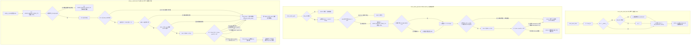

# state 通道 TTL 判定流程（bash 現行為）

單一寫者／owner gate／通知端新鮮度三視角；Rust 實作照此 parity。

```mermaid
flowchart TD
    subgraph HOOK_WRITE_STATE["hook_write_state (line 2035) 單一寫者寫 state"]
        W1["hook_write_state <file> <state> <ld> <owner>"] --> W2["ts = now_iso"]
        W2 --> W3{"ld == '__KEEP__'?"}
        W3 -- 是 --> W4{"state_file 存在?"}
        W4 -- 是 --> W5["jq 讀取原檔 last_delivered"]
        W4 -- 否 --> W6["ld = ''"]
        W5 --> W7["jq 生成 {state, ts, last_delivered, owner}"]
        W6 --> W7
        W3 -- 否 --> W7
        W7 --> W8["atomic_write 寫入 state_file (失敗則吞掉)"]
    end

    subgraph HOOK_OWNER_GATE["hook_owner_gate (line 2069) session_id 所有權閘門"]
        G1["hook_owner_gate <file> <sid>"] --> G2{"state_file 存在?"}
        G2 -- 否 --> G3["return 0 (放行 / 首次認領)"]
        G2 -- 是 --> G4["jq 讀取 owner = .owner // empty"]
        G4 --> G5{"owner 為空 或 owner == sid?"}
        G5 -- 是 (正主 / 舊格式無主) --> G6["return 0 (放行)"]
        G5 -- 否 (異主冒用) --> G7["讀取 ttl = AGENT_BRIDGE_STATE_TTL (預設 1800)"]
        G7 --> G8{"ttl 格式符合 ^[0-9]{1,9}$ 且 > 0?"}
        G8 -- 否 (壞值或 0) --> G9["ttl 修正為 預設值 1800"]
        G8 -- 是 --> G10["jq 讀取 ts = .ts // empty"]
        G9 --> G10
        G10 --> G11{"ts 非空 且 date -ud '$ts' +%s 解析 epoch 成功?"}
        G11 -- 否 (ts缺失/壞值 -> 視同過期) --> G12["return 0 (放行 / 允許新 session 接管)"]
        G11 -- 是 --> G13["now = $(date -u +%s)"]
        G13 --> G14{"0 <= (now - epoch) <= ttl?"}
        G14 -- 是 (異主 且 state 新鮮) --> G15["return 1 (擋下異主寫入 / 拒絕冒充)"]
        G14 -- 否 (過期 now-epoch > ttl 或 未來ts now-epoch < 0) --> G12
    end

    subgraph NOTIFY_OR_DEFER_STATE["notify_or_defer (line 371) 讀 state 的 TTL 新鮮度判定"]
        N1["notify_or_defer 讀取 state"] --> N2["ttl = AGENT_BRIDGE_STATE_TTL (預設 1800)"]
        N2 --> N3{"ttl 格式符合 ^[0-9]{1,9}$?"}
        N3 -- 否 (壞值/非數字/超過9位) --> N4["die AGENT_BRIDGE_STATE_TTL 需為非負整數"]
        N3 -- 是 --> N5["ttl = $((10#$ttl))"]
        N5 --> N6{"ttl > 0 且 state_file 存在?"}
        N6 -- 否 (ttl=0 通道關閉 / 無檔) --> N7["fresh_busy = 0 (視為未知，走 legacy notify_pane)"]
        N6 -- 是 --> N8["jq 解析 st = .state 與 ts = .ts"]
        N8 --> N9{"st 與 ts 是否均非空?"}
        N9 -- 否 (缺失/解析失敗) --> N7
        N9 -- 是 --> N10{"date -ud '$ts' +%s 解析 epoch 成功?"}
        N10 -- 否 (時間格式損壞) --> N7
        N10 -- 是 --> N11["now = $(date -u +%s)"]
        N11 --> N12{"st == 'busy' 且 0 <= (now - epoch) <= ttl?"}
        N12 -- st != 'busy' (如 idle) --> N7
        N12 -- ts 落在未來 (now - epoch < 0) --> N7
        N12 -- ts 已過期 (now - epoch > ttl) --> N7
        N12 -- st == 'busy' 且 0 <= (now - epoch) <= ttl --> N13["fresh_busy = 1 (明確 busy 且新鮮)"]
        N13 --> N14["延後通知，不送鍵\n等待 Stop hook 撿件"]
        N7 --> N15["走 legacy notify_pane 送鍵 (含雙掃描)"]
    end
```
